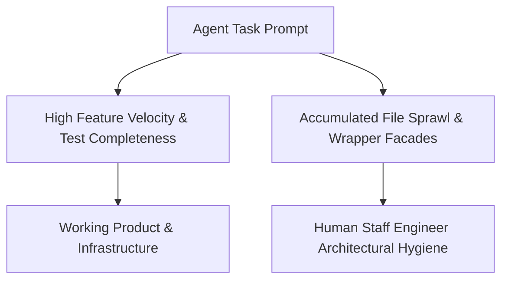

In software engineering, we have officially moved beyond simple inline autocomplete tools and basic chat assistants. We are living in the **Agentic Coding Era**.

Autonomous AI agents—such as Devin, Cursor Agent and Copilot Workspace, don't just complete lines of code. They read issue descriptions, map out multi-file architectures, write implementation code, execute terminal commands, debug runtime errors and submit ready-to-review pull requests.

When you inspect a codebase built predominantly through autonomous coding agents, one reaction is universal: **astonishment at the feature velocity, coupled with anxiety over the underlying codebase architecture.**

This shift brings unprecedented execution speed, but it also introduces a distinct technical challenge: **Agentic Codebase Entropy**. As velocity skyrockets, the role of the Staff Engineer is fundamentally evolving from writing syntax to exercising architectural governance.

---

## 1. The Anatomy of an Agentic Codebase

Autonomous agents do not write code the way human engineers write code, nor do they write code like simple LLM wrappers. They build systems with a distinct structural footprint.

### The Good: Enterprise Completeness by Default

When human engineers build a Proof-of-Concept (POC), we frequently cut corners on logging, edge-case error handling and deployment scripts to move fast. Autonomous agents do the exact opposite:

+ **Exhaustive Infrastructure & Boilerplate:** Agents naturally generate complete Infrastructure-as-Code (Terraform, CloudFormation), container configurations, edge-case network buffering handlers and OpenTelemetry instrumentation without needing to be asked twice.
+ **Rapid Domain Decomposition:** When tasked with refactoring a monolithic script, agents quickly break down complex logic into modular, decoupled design patterns like strategy patterns or independent orchestration networks.
+ **Built-in Self-Verification:** Because agents operate in goal-seeking feedback loops, they build extensive evaluation harnesses, automated test scripts and smoke tests to verify their own output before reporting task completion.

---

## 2. The Dark Side: Agentic Codebase Entropy

Despite high functional quality, agents exhibit specific behavioral biases that accumulate technical debt if left unchecked.

### A. The Additive Bias (Never Delete, Only Wrap)

AI agents operate under a primary constraint: **do not break existing functionality.**

When refactoring a module, an agent rarely deletes the old implementation. Instead, it defaults to additive modifications:
+ Backward-compatibility facades and re-export shims.
+ Parallel implementation files sitting directly alongside legacy code (e.g., `ModuleRefactor.py` next to `Module.py`).
+ Duplicate configuration files left behind in nested directories.

Over time, this creates a maze of facade layers where tracing the true source of truth requires wading through three layers of re-exported modules.

### B. One-Off Script & Artifact Sprawl

When an agent needs to test a feature, evaluate performance or process benchmark data, it creates dedicated scripts and markdown guides for that specific task.

If you prompt an agent 20 times across a sprint, you will often find 20 standalone `.py` scripts, temporary Excel or CSV result files, `.log` outputs and single-purpose `.md` docs scattered across the project root.

### C. Tactical Hacks vs. Structural Redesign

When an agent encounters a deep framework issue, such as a serialization error or type mismatch—it prioritizes resolving the immediate symptom to pass the test suite.

+ Instead of refactoring a database model or schema boundary, an agent might inject a recursive dictionary converter.
+ Instead of fixing a module import lifecycle, it might add imperative execution loops or `subprocess` calls directly into top-level module scopes.

These tactical patches resolve immediate errors and pass automated tests, but they introduce subtle runtime risks and import-time side effects that compound over time.

---

## 3. The Paradigm Shift: The Evolving Role of the Staff Engineer

In an AI-first development environment, the value of a Staff Engineer does not diminish. It escalates. However, the nature of the work changes fundamentally.

| Traditional Engineering Focus | Agentic Era Engineering Focus |
| :--- | :--- |
| Writing syntax, boilerplate, & feature logic | Defining architectural patterns & system invariants |
| Manual feature prototyping | Prompting, guiding, & reviewing agent outputs |
| Spot-checking pull requests for bugs | Managing codebase entropy & architectural hygiene |
| Writing unit test cases | Designing evaluation pipelines & benchmark suites |

In the agentic era, **the Staff Engineer functions as an Architectural Governor.** The AI provides raw execution horsepower; the human engineer provides vision, boundary enforcement, and long-term maintainability.

---

## 4. The Agentic Hygiene Playbook: 4 Rules for Engineering Teams

If your team is leveraging autonomous agents to build products, adopt these four practices to keep your codebase clean and scalable:

### Rule 1: Enforce Strict Repository Boundaries
Agents will commit anything in their workspace if permitted. Maintain tight `.gitignore` and `.dockerignore` rules to block temporary logs, benchmark CSVs, runtime artifacts, and compiled bytecode (`.pyc`, `.DS_Store`) from entering source control.

### Rule 2: Include Explicit Cleanup Instructions in Prompts
Agents follow instructions literally. Include a standard hygiene clause in your system prompts or agent instructions:
> *"Upon completing the task, delete all temporary test scripts, intermediate output files, and superseded draft implementations. Ensure no facade wrappers are left behind unless explicitly requested."*

### Rule 3: Conduct Regular Entropy Sweeps
Schedule periodic "hygiene sweeps" specifically dedicated to structural refactoring:
+ Consolidate one-off root scripts into a unified CLI tool.
+ Remove re-export facades once callers have been updated to target the new modules.
+ Move loose markdown documentation from the project root into a structured `docs/` directory.

### Rule 4: Audit Import-Time Behavior & Lifecycle Risks
Always review agent-generated code for top-level side effects. Ensure that module imports are pure and that heavy initialization, network calls or shell executions are deferred to runtime setup hooks or application startup events.

---

## Conclusion

Agentic coding is not a fad; it is the new baseline for software development. The goal is not to prevent agents from creating messy intermediate artifacts, but to recognize that **velocity requires governance**.

By pairing the incredible execution speed of autonomous AI agents with the strategic oversight, boundary enforcement and architectural rigor of Staff Engineers, teams can ship enterprise-grade software faster than ever before—without sacrificing codebase health.
